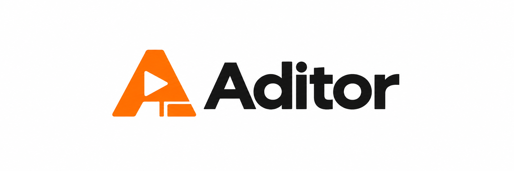

<p align="center">
  
</p>

<h1 align="center">From agent action to finished video.</h1>

<p align="center">
  <strong>Capture tabs. Record demos. Cut, speed up, and ship.</strong><br>
  A Rust CLI that brings screen capture and video editing into your automation workflow.
</p>

<p align="center">
  <a href="https://github.com/victorlcampos/aditor/actions/workflows/release.yml"></a>
  <a href="https://github.com/victorlcampos/aditor/releases/latest"></a>
  <a href="LICENSE"></a>
  
  
</p>

<p align="center">
  <a href="https://github.com/victorlcampos/aditor/releases/latest"><strong>Download latest</strong></a> ·
  <a href="#get-started">Get started</a> ·
  <a href="#browser-tabs">Capture a tab</a> ·
  <a href="#video-editing">Edit videos</a> ·
  <a href="#agent-interface">Integrate with your agent</a>
</p>

## Your agent gets things done. Now it can show its work.

A completed task is easier to understand with a screenshot, a demo, or a video clip. **Aditor** turns terminal commands into those deliverables: from capturing a specific browser tab to trimming the final recording.

Built for agents that run commands, scripts, and developers who want to **automate capture and editing** with explicit IDs, JSON output, and terminal control.

| What you want to deliver | How Aditor helps |
| --- | --- |
| A product demo | Record just the selected tab, without browser chrome. |
| Visual evidence of a task | Save a PNG of a tab, monitor, or CSS-selected element. |
| A video that gets to the point | Trim, adjust speed, and remove audio in one command. |
| Capture during an automation | Start in the background and stop by session ID. |
| A predictable integration | Use `--json`, `--dry-run`, and exit codes to control the workflow. |

```sh
# With the browser configured for CDP (instructions below):
aditor tabs --json

# Replace ABC123 with the returned tab ID.
aditor record --tab ABC123 --duration 15 -o demo.mp4 --json

# Turn the capture into a shorter demo.
aditor edit demo.mp4 --from 2 --duration 10 --speed 2 --mute -o demo-final.mp4 --json
```

## Get started

**[Download the latest release](https://github.com/victorlcampos/aditor/releases/latest)** — ready-to-run binaries, no Rust installation required.

| Operating system | Download latest |
| --- | --- |
| macOS Apple Silicon | [Download ARM64](https://github.com/victorlcampos/aditor/releases/latest/download/aditor-aarch64-apple-darwin.tar.gz) |
| macOS Intel | [Download x86_64](https://github.com/victorlcampos/aditor/releases/latest/download/aditor-x86_64-apple-darwin.tar.gz) |
| Linux x86_64 (Ubuntu 22.04 or newer) | [Download Linux](https://github.com/victorlcampos/aditor/releases/latest/download/aditor-x86_64-unknown-linux-gnu.tar.gz) |
| Windows x86_64 | [Download Windows](https://github.com/victorlcampos/aditor/releases/latest/download/aditor-x86_64-pc-windows-msvc.zip) |

These links always resolve to the latest published release. [Download SHA256SUMS](https://github.com/victorlcampos/aditor/releases/latest/download/SHA256SUMS) to verify your archive.

Extract the archive and move `aditor` (or `aditor.exe`) to a directory on your
`PATH`. Run `aditor --version` to verify the installation. Downloads include the
README and license; `SHA256SUMS` contains checksums for all archives. On Linux,
verify your download with `sha256sum --ignore-missing --check SHA256SUMS`; on
macOS, use `shasum -a 256 <archive>` and compare the result with `SHA256SUMS`.
On Windows, use `Get-FileHash <archive> -Algorithm SHA256` in PowerShell.
The binaries are unsigned; macOS or Windows may require approval to run them.

To install from source, Rust and Cargo are required:

```sh
git clone https://github.com/victorlcampos/aditor.git
cd aditor
cargo install --path . --locked
aditor --help
```

Or build without installing:

```sh
cargo build --release --locked
./target/release/aditor --help
```

Tab capture uses Chrome, Chromium, or Edge with CDP enabled; screen capture requirements vary by operating system, as described below.

FFmpeg is resolved automatically (embedded, sidecar, PATH, or download). Set `ADITOR_FFMPEG` and `ADITOR_FFPROBE` to use specific binaries. Tab screenshots and tab listing use CDP directly, without FFmpeg.

## Browser tabs

Start Chrome, Chromium, or Edge with CDP and a separate profile. On macOS:

```sh
"/Applications/Google Chrome.app/Contents/MacOS/Google Chrome" \
  --remote-debugging-port=9222 --user-data-dir=/tmp/aditor-chrome
```

Open your page in that browser. Chrome requires a directory other than the default profile to enable remote debugging; see the [Chrome documentation](https://developer.chrome.com/blog/remote-debugging-port). `aditor tabs --help` also includes setup instructions for Linux and Windows.

```sh
aditor tabs --json
# [{"id":"ABC123", "title":"My page", "url":"https://..."}]

aditor screenshot --tab ABC123 -o tab.png --json
aditor record --tab ABC123 --duration 10 -o tab.mp4 --json

# Without a duration: return an ID and keep recording in the background.
aditor record --tab ABC123 -o demo.mp4 --json
aditor stop rec-... --json
```

Use the exact ID returned by `tabs`. For a different port, pass `--cdp-port 9333` to `tabs`, `record --tab`, and `screenshot --tab`. The connection uses `127.0.0.1`; there is no ambiguous title matching or focus switching.

Capture uses CDP's [Page.captureScreenshot](https://chromedevtools.github.io/devtools-protocol/tot/Page/#method-captureScreenshot): only the visible page area, without browser chrome or other tabs. It works with another tab in the foreground. It does not capture the entire scrollable page or include audio; `--tab --audio` is rejected. Safari and Firefox are not supported by this backend. If the browser renders more slowly than `--fps`, frames are repeated to preserve video duration.

## Capture an element by CSS selector

Use `--selector` together with a tab ID:

```sh
aditor screenshot --tab ABC123 --selector '#player' -o player.png --json
aditor print --tab ABC123 --selector '[data-testid="chart"]' -o chart.png --json
aditor record --tab ABC123 --selector '.preview > canvas' --duration 10 -o canvas.mp4 --json

# Also works in the background; finalize with stop.
aditor record --tab ABC123 --selector '#player' -o player.mp4 --json
aditor stop rec-... --json
```

The selector must match **exactly one rendered element** in the main document. Invalid, empty, missing, or ambiguous selectors and hidden elements return an error; there is no fallback to capturing the entire tab. Selectors do not cross iframe or shadow DOM boundaries. Quote selectors in the shell to preserve spaces and special characters.

Capture crops the element's rectangle, including its border, even outside the viewport. It does not scroll the page or change focus. This is a crop of the rendered page: overlays and ancestor clipping remain visible; it does not extract an isolated DOM layer.

During video recording, the selector and rectangle are reevaluated every frame. For precise cropping, prefer a fixed-position container with animated content: fast movement of the container itself between measurement and capture may include background edges. Keep the element's dimensions fixed: if it resizes, disappears, or becomes hidden, recording ends with an error and finalizes the footage already captured. Videos may receive up to one pixel of padding to maintain the even dimensions required by the codec. `--dry-run --json` includes the selector in the plan without connecting to the browser.

## Monitors and screenshots

On macOS, list capture indices before choosing a monitor:

```sh
aditor screens --json
# [{"screen":0,"name":"Capture screen 0"},{"screen":1,"name":"Capture screen 1"}]

aditor record --screen 1 --duration 10 -o monitor.mp4 --json
aditor screenshot --screen 1 -o monitor.png --json
aditor print --screen 0 --json  # alias for screenshot
```

`screen` is the monitor index, not the AVFoundation camera index. Without `--screen` or `--tab`, macOS captures monitor 0. The terminal needs Screen Recording permission on macOS. `--audio` includes the microphone in native recordings; `--audio-device` selects the device.

`--screen`, `--tab`, and `--video-device` are mutually exclusive. On Linux, native capture uses X11 (`--video-device :0.0`, default: `$DISPLAY`); on Windows, it uses GDI (`--video-device desktop` or `--video-device 'title=Window name'`). Monitor enumeration and selection through `--screen` are available on macOS. On other platforms, this option returns an error instead of ignoring the requested monitor.

## Agent interface

- `--json`: successful results as JSON on stdout; logs and errors on stderr. Failures return a nonzero exit code.
- `--dry-run`: show the plan/command without capturing or creating output directories. With `--tab`, do not connect to the browser. The video plan shows that `pipe:0` receives CDP frames; the FFmpeg command alone does not produce that input.
- `record --duration`: wait until complete and return the finalized file.
- `record` without a duration: return `id`, `pid`, `output`, and the `stop` command. Works for both tabs and native capture.
- `stop ID`: finalize the MP4 before returning; without an ID, require exactly one session. `stop --all` stops all sessions.
- `screenshot`/`print`: save a single PNG and exit, without a background session.
- `-o`: output file path; when omitted, videos go to `~/Documents/Videos` and screenshots to `~/Documents/Pictures`. `--dir` changes the directory. Capture commands return absolute paths.
- Existing files are refused; `--yes` allows overwriting. Screenshots require the `.png` extension.

## Video editing

```sh
aditor info input.mp4 --json
aditor speed input.mp4 -x 1.5 -o faster.mp4 --json
aditor cut input.mp4 --from 00:01:30 --duration 10 -o clip.mp4
aditor edit input.mp4 --from 5 --duration 20 --speed 2 --mute -o edited.mp4
aditor convert input.mp4 --codec hevc -o smaller.mp4
aditor doctor --json
```

## Validation

```sh
cargo fmt --check
cargo test --locked
cargo clippy --locked --all-targets -- -D warnings
cargo build
python3 tests/browser_cli.py \
  --browser '/Applications/Google Chrome.app/Contents/MacOS/Google Chrome' \
  --aditor target/debug/aditor
```

The integration test starts headless Chrome with a temporary profile and checks tab selection, CSS selector cropping (dimensions and content), PNG output, overwriting, video duration, background/stop, errors, and dry runs. It does not use your personal browser profile. Requires Chrome/Chromium and FFmpeg/ffprobe on PATH.

## Contributing

All project content and contribution metadata must be written in English; see
[project rules](AGENTS.md).

The `Release CLI` GitHub Actions workflow validates pull requests and publishes a
release for the tip commit of every push to `main` after all four platform builds
pass formatting, tests, Clippy, and CLI smoke checks. A push containing multiple
commits produces one release for its final commit. No manual tag or version bump
is needed. You can also trigger a build using **Run workflow** on `main`. Releases use `<Cargo version>+build.<run number>.<short commit SHA>`
(for example, `0.1.0+build.42.abcdef123456`), also shown by `aditor --version`.
The suffix is SemVer build metadata; the base API version remains in `Cargo.toml`.
Rerunning a workflow reuses the same release tag. Archive names stay constant across
versions so the direct download links above never need to change. Each binary
reports its exact release version. Build caches speed up subsequent runs, and
the Actions summary includes checksums and download links. Releases are assembled as drafts
and published only after every archive and checksum has uploaded. Builds use the
default features; FFmpeg is resolved at runtime and is not bundled in the archives.
Publishing uses the built-in `GITHUB_TOKEN` with `contents: write`; no personal
access token is required. GitHub Actions must be enabled for the repository.

Have a capture or editing workflow you want to automate? [Open an issue](https://github.com/victorlcampos/aditor/issues) with your use case, operating system, and expected result. Fixes and improvements via pull request are welcome; run the checks above before submitting.

If Aditor fits your next agent, **give it a star and try your first capture**.

## License

Code is distributed under the [MIT license](LICENSE). FFmpeg and ffprobe are third-party components subject to the licenses of the distribution used.
